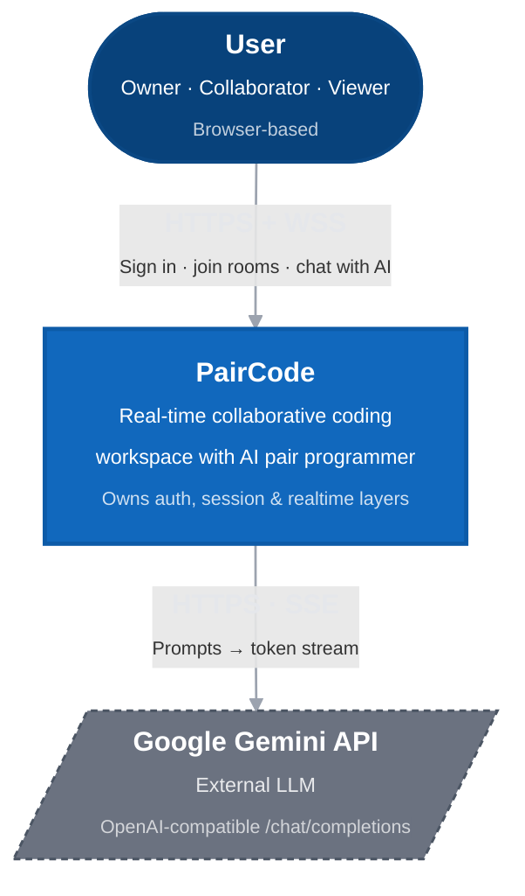
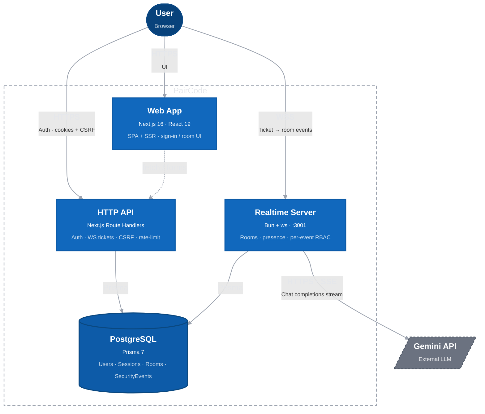
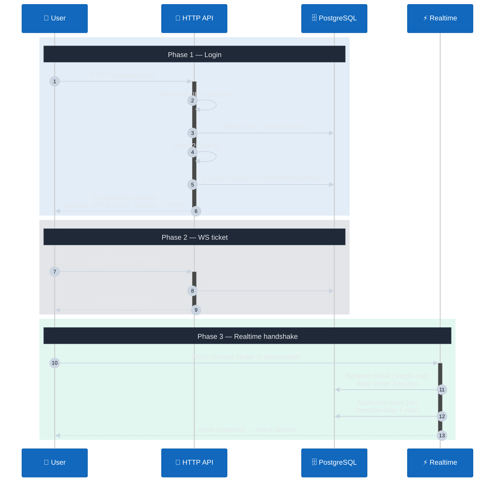
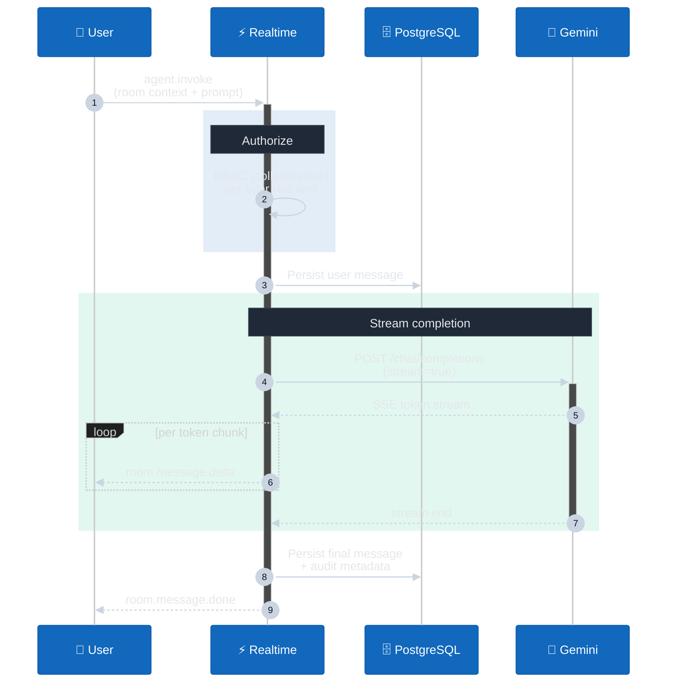

# PairCode — C4 Architecture

Two C4 levels: **System Context** (who uses it, what it depends on) and **Containers** (what processes/stores make up the system, and how they talk).

Diagrams use Mermaid's C4 syntax — they render on GitHub, in most Markdown viewers, and in [mermaid.live](https://mermaid.live).

---

## Level 1 — System Context

**Notes**
- PairCode is a single product boundary; everything inside (web, API, realtime, DB) is owned by us.
- Gemini is the only outbound third party in the security perimeter. Its API key never leaves the WebSocket server process.

---

## Level 2 — Containers

---

## Container responsibilities (what each box owns)

| Container | Owns | Does NOT own |
|---|---|---|
| **Web App** | UI, routing, optimistic state, WS client | Authorization, secrets, session truth |
| **HTTP API** | Credential verification (Argon2id), JWT minting (EdDSA via `jose`), refresh-token rotation with reuse detection, CSRF token mint/verify, WS ticket issuance, rate limiting, security event logging | Long-lived realtime connections |
| **Realtime Server** | WS handshake (single-use ticket → session), room state in memory, per-event RBAC, message persistence, AI relay, rate limiting | Password verification, JWT minting |
| **PostgreSQL** | Source of truth: identity, sessions, refresh-token chain, room membership, message history, security audit log | Application logic — pure data |

---

## Two flows worth knowing for a review

### Login → first WebSocket connection

### AI assist inside a room

---

## Cross-cutting concerns

- **Authentication.** EdDSA-signed JWTs (short-lived access, ~minutes) + rotating refresh tokens stored hashed with `replacedById` chain to detect reuse. Sessions can be revoked server-side (`Session.revokedAt`); JWT verification additionally checks an in-DB `credentialVersion` to invalidate all tokens on password change.
- **Authorization.** Room-level RBAC (`owner` / `collaborator` / `viewer`) checked **per WebSocket event**, not just at handshake. HTTP routes use a `requireUser` guard.
- **CSRF.** Double-submit token: HttpOnly cookie + header on every state-changing HTTP request. WS handshake instead uses the single-use ticket pattern, which is not vulnerable to CSRF.
- **Rate limiting.** Token-bucket keyed by IP, account, or userId. Applied on login, signup, refresh, ws-ticket issuance, and per-event on the WS server.
- **Audit trail.** `SecurityEvent` table indexed on `(kind, at)` and `(userId, at)` records auth attempts, ticket issuance/redemption, room access decisions, rate-limit trips.
- **Secrets.** JWT private key on disk (`jwt-private.pem`), public key distributed to verifiers. Gemini key only in the realtime server process. `INVITE_SIGNING_SECRET` required at boot.

---

## Trust boundaries (what a reviewer would draw red lines around)

1. **Browser ↔ HTTP API** — credentials cross here; everything else relies on cookies + CSRF.
2. **Browser ↔ Realtime Server** — single-use ticket is the only thing carrying identity across this boundary; ticket is hashed in DB and consumed atomically on redeem.
3. **Realtime Server ↔ Gemini** — outbound only; user content leaves the perimeter, so prompt content is the place to apply LLM guardrails / prompt-injection defenses.
4. **App ↔ PostgreSQL** — least-privilege DB role; all queries via Prisma (parameterized).

---

## What this diagram deliberately does NOT show

- Component-level (C4 L3) breakdown of `lib/auth/*` and `server/security/*` — would be a separate diagram per container.
- Deployment topology (C4 L4) — single Postgres, two Node processes today; would be one Mermaid block if needed for an ops review.
- Frontend state management — irrelevant to a security/architecture review.
